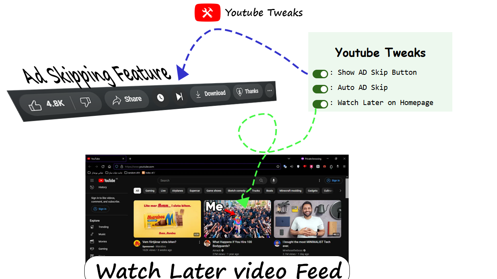

> Direction for **How to install?** :
1. Download this repository and Extract it
2. Open Chrome.
3. In the top right, click on the three dots and select:
   - Extensions < Manage Extensions (or open this url: [Chrome Extensions](chrome://extensions/))
4. In the top right corner enable the "Developer Mode".
5. In the left top corner click on "Load Unpacked" Button.
6. Select this folder.
7. Enable all the features required by pressing on the extension icon in the top and choosing from the list.

> Save the extracted folder somewhere safe and then import it in chrome, so you don't delete it by accident.